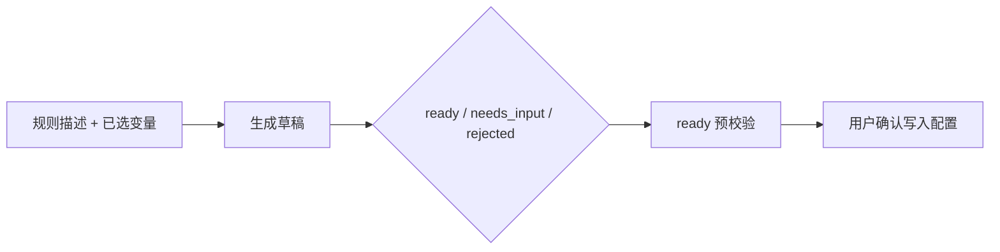

# Excel Check 架构设计

> 本文档只记录稳定架构、核心契约、接口边界和限制。启动、部署和联调见 [../README.md](../README.md)，代码位置见 [MODULES.md](MODULES.md)。

## 1. 系统边界

Excel Check 解决配置表规则校验的工程问题：把数据源、变量和规则抽象为统一 `TaskTree`，个人校验和项目校验共用同一个执行引擎与结果协议。

| 业务线 | 路由 | 持久化边界 | 用途 |
|---|---|---|---|
| 个人校验 | `/` | `project_id + user_id` | 临时排查、个人编排、AI 草稿确认。 |
| 项目校验 | `/fixed-rules` | `project_id` | 长期规则配置、导入个人规则、周期性复用。 |

明确不做：

- 不做 SaaS 化、容器编排、反代、HTTPS。
- 不恢复 CSV 数据源。
- 飞书只支持电子表格和 wiki 电子表格链接；不支持多维表格、文档表格或任意 Drive 文件。
- AI 不直接写底层执行配置，只生成草稿并由用户确认。
- SVN 远端只支持白名单 host、`http(s)://`、单文件 `.xls/.xlsx`。

## 2. 核心契约

### 2.1 `TaskTree`

`TaskTree` 是统一执行入参：

```python
class TaskTree:
    sources: list[DataSource]
    variables: list[VariableTag]
    rules: list[ValidationRule]
```

关键字段：

- `DataSource`: `id / type / path / url / pathOrUrl / token`
- `VariableTag`: `tag / source_id / sheet / variable_kind / column / columns / key_column / expected_type`
- `ValidationRule`: `rule_id / rule_type / params`

执行入参模型默认拒绝未知字段；历史字段兼容只在配置读取、迁移或导入层处理。

### 2.2 项目校验配置

项目校验配置当前版本为 `version = 6`，包含 `sources / variables / groups / rules`。旧版 `version 2/3/4/5` 在读取时自动迁移。多组串行和多组映射规则仍保留部分兼容字段，但真实执行以节点配置为准。

### 2.3 统一执行结果

`POST /api/v1/engine/execute` 与 `POST /api/v1/fixed-rules/execute` 返回同一结构：

```python
{
    "code": 200,
    "msg": "Execution Completed",
    "meta": {
        "execution_time_ms": int,
        "total_rows_scanned": int,
        "failed_sources": [str],
    },
    "data": {
        "abnormal_results": [
            {
                "level": "error",
                "rule_name": str,
                "location": str,
                "row_index": int,
                "raw_value": Any,
                "display_value": Any,
                "message": str,
            }
        ]
    },
}
```

固定规则配置读取可额外返回 `meta.config_issues`，用于非阻断告警。

## 3. 规则能力

当前规则库支持 10 类规则：

| 规则类型 | 说明 |
|---|---|
| `not_null` | 单字段非空。 |
| `unique` | 单字段唯一。 |
| `fixed_value_compare` | 单字段与固定值或规则集比较。 |
| `regex_check` | 正则完整匹配。 |
| `sequence_order_check` | 按原始行序校验连续性。 |
| `cross_table_mapping` | 单字段包含于引用变量。 |
| `composite_condition_check` | 组合变量筛选和分支断言。 |
| `dual_composite_compare` | 两组组合变量筛选、Key 对齐和字段比较。 |
| `multi_composite_pipeline_check` | 多组串行节点，失败短路。 |
| `multi_composite_mapping_check` | 多组映射节点，独立汇总异常。 |

规则引擎由注册调度、领域工具和 handler 三层组成。旧路径 shim 仅为兼容保留。

## 4. API 边界

所有业务 API 位于 `/api/v1` 下。

| 模块 | 入口 |
|---|---|
| 认证 | `/auth/register`、`/auth/login`、`/auth/me`、`/auth/change-password`、`/auth/switch-project/{project_id}` |
| 管理后台 | `/admin/projects*`、`/admin/projects/{id}/members*`、`/admin/users/{id}/reset-password`、`/admin/projects/{id}/feishu-bot*` |
| 数据源 | `/sources/capabilities`、`/sources/upload`、`/sources/local-pick`、`/sources/metadata`、`/sources/column-preview`、`/sources/composite-preview`、`/sources/svn-*` |
| 飞书数据源 | `/feishu/sources/check-permission`、`/feishu/sources/send-authorization-card`、`/feishu/sources/oauth/callback` |
| 个人校验 | `/workbench/config`、`/workbench/svn-update`、`/engine/execute` |
| AI 规则助手 | `/ai/providers/me`、`/ai/agents/rule-draft`、`/ai/agents/rule-prompt-optimize`、`/ai/drafts` |
| 项目校验 | `/fixed-rules/config`、`/fixed-rules/import/workbench/draft`、`/fixed-rules/import/workbench/preview`、`/fixed-rules/import/workbench/commit`、`/fixed-rules/execute`、`/fixed-rules/results/*` |

SVN 鉴权失败使用 HTTP 403，不触发前端登录态过期逻辑；HTTP 401 只表达认证失效。

飞书数据源权限不足时不直接失败为登录态问题：前端先调用权限检测接口，必要时通过项目飞书机器人向默认群发送授权卡片；有权限的飞书用户完成 OAuth 后，服务端把机器人加入表格只读协作者，再复用同一飞书电子表格读取链路获取元数据、列预览和执行数据。

## 5. AI 规则助手

AI 规则助手只作用于个人校验步骤 03：



约束：

- `dry_run=true` 只做本地线索抽取，不读 AI 凭据、不调用模型、不写草稿历史。
- `ready` 必须预校验后才能确认添加。
- `needs_input` 只提示缺口，不保存半成品。
- `rejected` 表示当前规则库不支持。
- 模型上下文不发送业务单元格值，只发送元数据、变量 schema 和规则摘要。

## 6. 多用户与安全

- JWT 携带用户与当前项目。
- 超级管理员可管理全部项目；项目管理员只能管理授权项目和受限默认项目视图。
- 个人校验配置按 `project_id + user_id` 隔离。
- 项目校验配置按 `project_id` 隔离。
- SVN 凭据按用户和 host 隔离，使用 Fernet 加密落盘。
- SVN URL 受 `SVN_URL_ALLOWLIST` 限制。
- 飞书机器人配置按项目隔离，`app_secret` 加密落库；飞书表格授权记录按 `project_id + source_id` 记录，并可按 spreadsheet token 复用已授权表格。

## 7. 已知限制

| 限制 | 状态 |
|---|---|
| 飞书数据源 | 仅支持飞书电子表格和 wiki 电子表格，依赖项目机器人、OAuth callback 和表格只读授权。 |
| CSV 数据源 | 已下线，仅保留历史提示。 |
| 多配置集切换 | 未开放。 |
| SVN 远端 | 仅支持白名单 host、`http(s)://`、单文件 Excel。 |
| SVN 缓存清理 | 暂无定时清理策略。 |
| AI 能力 | 只覆盖当前 10 类规则；聚合、公式、平均值等复杂规则返回 `rejected`。 |
